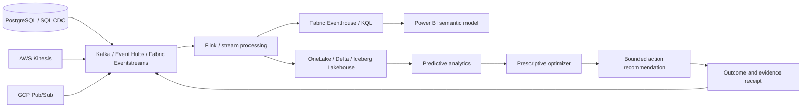

# Real-Time AI Data Platform

## Microsoft Fabric, Power BI, Azure Databricks, Data Engineering, Data Science, Predictive Analytics, Prescriptive Analytics, Kafka, Lakehouse, RAG, MCP and Multi-Cloud Architecture

**RealTimeIQ** is an open-source reference platform for turning streaming operational data into predictive risk, prescriptive actions, executive business intelligence and measurable unit economics.

It demonstrates the complete decision path:

```text
operational event → governed data product → prediction → recommended action
→ operator decision → business outcome → model and economic evaluation
```

> **Claim boundary:** the executable case study uses synthetic customers, orders, outcomes and costs. It does not claim production model accuracy, realized revenue, a live Microsoft Fabric deployment or access to customer data.

## The painful, urgent and frequent problem

Enterprises have data in databases, SaaS systems, logs, IoT platforms and multiple clouds, but their analytics and AI systems often see it late, without consistent identity, permissions, lineage or business context.

That creates recurring losses:

- revenue-risk conditions are discovered after an SLA is missed;
- dashboards disagree because their semantic definitions differ;
- AI agents retrieve stale or conflicting context;
- data scientists optimize offline accuracy without measuring intervention value;
- cloud and data-platform cost cannot be attributed to a successful workflow;
- expected savings are presented as realized results without a causal boundary.

RealTimeIQ connects Data Engineering, Business Intelligence and Data Science to an auditable business outcome.

## Architecture



See the [full multi-cloud architecture](docs/architecture.md).

## Executable revenue-at-risk case study

The deterministic vertical slice evaluates twelve synthetic global orders using supplier delay, inventory coverage, open incidents, sentiment, customer tier, contractual penalties and contribution margin.

```bash
PYTHONPATH=src python3 -m unittest discover -s tests -v

PYTHONPATH=src python3 -m realtimeiq.cli \
  examples/revenue-at-risk/scenario.json \
  --output generated/revenue-at-risk
```

It produces:

- a predictive delay probability and risk band;
- confusion matrix, precision, recall and Brier score;
- economically ranked interventions;
- modeled platform cost and return per platform dollar;
- an executive Markdown scorecard;
- a standalone executive BI dashboard;
- a deterministic SHA-256 evidence receipt;
- an explicit `auto_execute: false` production boundary.

Current verified baseline: **10 behavioral tests**, **7 prioritized interventions**, **100% synthetic-fixture precision**, **85.71% synthetic-fixture recall**, `$283,778.86` modeled net expected value and deterministic receipt `86c813261653d3a49387aac648209da083e2ff5dacec369232b5be85098707fd`. These fixture metrics must not be represented as prospective production performance.

Open [the generated executive dashboard](generated/revenue-at-risk/executive-dashboard.html) or review [the decision scorecard](generated/revenue-at-risk/executive-scorecard.md).

## Business Intelligence and Power BI

The BI layer includes:

- a decision-intelligence star schema;
- type-2 customer dimensions;
- prediction and outcome separation;
- Power BI DAX measures for expected value, realized value, precision, recall and freshness;
- executive, model-performance, intervention and platform-economics dashboard pages;
- drill-through from KPI to order, source lineage and receipt.

See [the BI dashboard specification](bi/dashboard-spec.md), [star schema](bi/star-schema.sql) and [DAX measures](bi/power-bi-measures.dax).

## Data Science and predictive analytics

The first model is deliberately transparent: a deterministic logistic risk score with versionable coefficients. This makes the entire calculation inspectable and testable.

The evaluation reports:

- precision and recall;
- true/false positives and negatives;
- probability calibration through Brier score;
- decision threshold;
- outcomes retained independently from predictions.

The small fixture proves software behavior—not production statistical validity. A real deployment needs representative historical data, temporal validation, drift monitoring, subgroup analysis and prospective measurement.

## Prescriptive analytics

The optimizer compares observe, priority support, shipment acceleration and inventory rerouting. It estimates:

```text
expected avoided loss
− intervention cost
= modeled expected action value
```

Only positive expected-value actions are recommended. No action executes automatically. Production use requires operator approval, authorization, a bounded canary and outcome reconciliation.

## Clear unit economics

The platform measures three layers:

| Layer | Economic unit |
|---|---|
| Infrastructure | Cost per million events, GB processed and TB queried |
| Data product | Cost per fresh, valid and authorized customer/order state |
| Business workflow | Cost per evaluated order, accepted intervention and realized outcome |

The included scenario models 500 million events at a configurable `$16` per million, giving an `$8,000` data-platform cost. All economics are inputs and modeled opportunity—not vendor quotations or guaranteed results. See the [unit-economics contract](docs/unit-economics.md).

## Azure, Microsoft Fabric and Databricks

The Azure Bicep module creates a minimal observability and evidence-storage plane. Event Hubs is conditional and disabled by default to prevent accidental streaming cost.

Target integrations include:

- Fabric Eventstreams, Real-Time Hub and Eventhouse;
- OneLake and Power BI;
- Azure Event Hubs;
- Azure Databricks and AI Search;
- Azure Monitor and Application Insights;
- managed identities, private networking and policy-controlled deployment.

The repository does not claim that these managed integrations have been deployed in the current release.

## OSS-first and multi-cloud distribution

The local scaffold uses PostgreSQL and Redpanda-compatible Kafka. Production adapters can support Flink, Iceberg/Delta, Trino, OpenSearch, DataHub/OpenLineage and Kubernetes alongside AWS Kinesis and GCP Pub/Sub.

That supports four distribution paths:

1. Free OSS reference implementation and synthetic benchmark.
2. Paid data-platform and decision-intelligence assessment.
3. Fixed-scope implementation accelerator.
4. Managed DataOps, BI, MLOps and optimization retainer.

## Repository map

```text
src/realtimeiq/                predictive, prescriptive and economics engine
examples/revenue-at-risk/      deterministic synthetic case study
generated/revenue-at-risk/     scorecards, dashboard and evidence receipt
bi/                            star schema, DAX and dashboard specification
contracts/                     versioned streaming event contract
infra/azure/                   cost-bounded Bicep evidence plane
docs/                          architecture, economics and search positioning
tests/                         behavioral and claim-boundary tests
```

## Search and hiring relevance

The public surface is aligned to current category language: Data Engineering, Microsoft Fabric, Power BI, Azure Databricks, Data Science, Predictive Analytics, Prescriptive Analytics, Kafka, Change Data Capture, Lakehouse, Real-Time Analytics, AI Agents, RAG, MCP, DataOps, MLOps, Kubernetes and Multi-Cloud Architecture.

Exact keyword volumes are not claimed without proprietary tooling. Every term is mapped to implemented evidence or a clearly identified roadmap boundary in the [search-positioning map](docs/search-positioning.md).

## Roadmap

- Debezium CDC and Kafka event replay
- Flink stateful enrichment and late-event handling
- Iceberg/Delta lakehouse tables and dbt transformations
- Fabric Eventstream and Eventhouse deployment adapter
- Power BI project artifact and live semantic-model refresh
- Azure Databricks MLflow experiment and AI Search adapter
- Temporal train/validation split, drift and subgroup evaluation
- Causal intervention measurement and outcome reconciliation
- Permission-aware MCP context server
- AWS Kinesis and GCP Pub/Sub integration tests

## Work with A2Z SOC

Need a production data, analytics or AI modernization program? **[Request a Real-Time Data and Decision Intelligence Assessment](https://a2zsoc.com)** covering Microsoft Fabric, Power BI, Databricks, Kafka, lakehouse architecture, predictive analytics, prescriptive optimization, multi-cloud infrastructure and unit economics.
