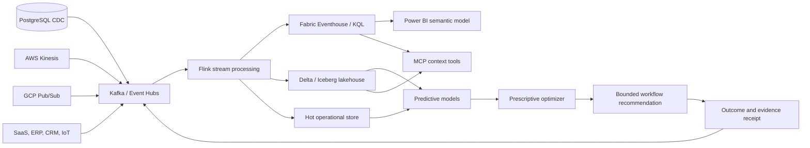

# Real-time data, analytics and AI architecture

## Medallion and streaming responsibilities

- **Bronze:** immutable source events, ingestion metadata and trace context.
- **Silver:** deduplicated, schema-valid, entity-resolved operational facts.
- **Gold:** customer, order, revenue-risk and intervention data products.
- **Serving:** Eventhouse/KQL for real-time BI, lakehouse for history and training, operational store for low-latency context.

## Predictive versus prescriptive boundaries

The predictive model estimates delay probability. The prescriptive layer evaluates actions against configurable cost and risk-reduction assumptions. It returns the highest positive expected-value recommendation. It does not execute the action.

Production deployment requires prospective validation, treatment/control measurement, authorization, operator approval and outcome reconciliation. Offline precision alone is insufficient.

## Platform variants

| Capability | Azure managed | OSS / hybrid |
|---|---|---|
| Streaming | Event Hubs, Fabric Eventstreams | Kafka or Redpanda |
| Stream processing | Fabric Eventstreams, Databricks | Flink |
| Real-time analytics | Eventhouse / KQL | ClickHouse or Apache Pinot |
| Lakehouse | OneLake, Azure Databricks | Iceberg/Delta plus object storage |
| BI | Power BI | Apache Superset or Grafana |
| Lineage | Purview / Fabric | OpenLineage and DataHub |
| AI serving | Foundry / Databricks | Kubernetes-hosted services |
